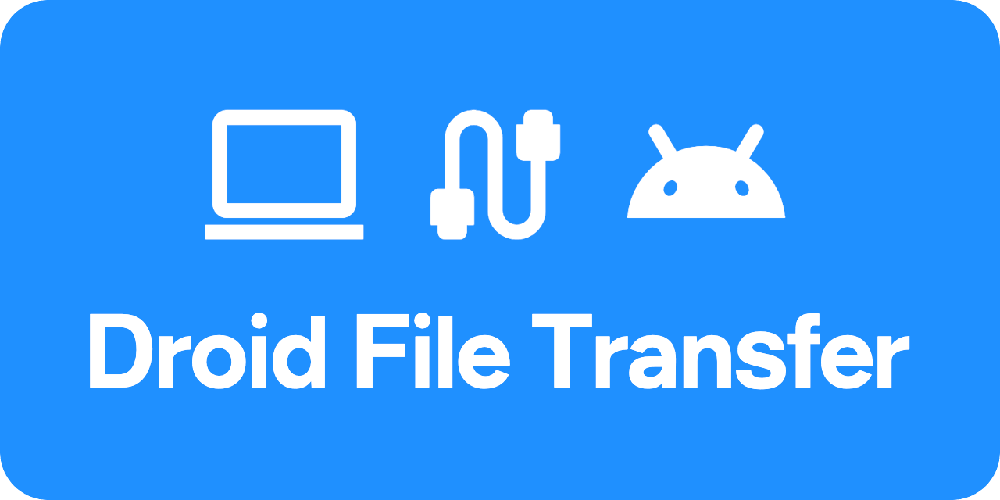

<div align="center">
<a href="https://www.droidfiletransfer.com/">
  
</a>

**[www.droidfiletransfer.com](https://www.droidfiletransfer.com/)**

</div>

Copy files between a Mac and an Android phone over USB, in the browser.
Nothing to install, no files uploaded anywhere. A replacement for Google's
discontinued Android File Transfer.

Tested in Chrome on macOS and Linux. Chrome also offers to install it as an
app. Other browsers are untested.

Windows is not supported: its MTP driver owns the phone, so Chrome cannot
claim it without replacing the driver with WinUSB.

## Use it

1. Plug the phone in. Quit Preview, Photos and Image Capture, which can hold
   the phone.
2. Unlock the phone, tap the **Charging this device via USB** notification and
   choose **File transfer**.
3. Click **Choose phone** and pick it from Chrome's list.
4. Choose the folder on the Mac the app may use. Files are copied to and from
   it, and it is remembered for next time as long as Chrome keeps the
   permission. Chrome refuses the Documents, Desktop, Downloads and home
   folders directly, so use or create a folder inside one, such as
   `Documents/Phone`.

### Working with files

The **Help** button at the top right of the app shows this list too.

- **Select**: click a file or folder. ⌘-click adds one more, ⇧-click selects
  everything between the last click and this one, ⌘A selects all. Esc, or a
  click on empty space, clears the selection.
- **Navigate**: ↑ and ↓ move the selection. Hold ⇧ while pressing them to select
  several. → or a double-click opens a folder. ← goes up one folder, and so
  does clicking a folder name in the path above the list.
- **Copy**: select on one side, then click the button in the middle or press
  C. Folders are copied with everything inside, except Mac files and folders whose names
  start with a dot. Only one side can have a selection, so the button always
  knows which way to copy.
- **Delete**: the trash button at the top right of the pane, or the Delete
  key. It asks first, skips the Trash and cannot be undone.
- **Rename**: on the phone side, select one item and press Enter, or click the
  pencil button. On the Mac, rename in Finder.
- **New folder**: the folder button at the top right of each pane. The folder
  is created in the folder that pane is showing.

## How it works

```
fonts/       Figtree and a Material Symbols subset
index.html   UI
js/app.js    panes, selection, transfer queue, File System Access API
js/mtp.js    MTP over WebUSB, no dependencies
js/pwa.js    the Install button and the service worker registration
style.css    styles
sw.js        precaches the app so it runs with no network
```

**Why a web page can do this.** Android's MTP responder presents a USB Still
Image interface, class `0x06`. WebUSB blocks a fixed list of classes (audio,
HID, mass storage, hub, smart card, video, audio/video, wireless controller),
and Still Image is not on it, so a page may claim the interface. Older Android
kernels exposed MTP as vendor-specific (`0xff/0xff/0`); the app accepts both.
macOS treats class `0x06` as a camera, and in testing Preview, Photos and Image
Capture held the phone through `ptpcamerad` and blocked the app.

**The protocol.** MTP is PTP (ISO 15740) plus Microsoft's extensions: a 12-byte
container header (length, type, code, transaction ID) and an optional payload,
over two bulk endpoints. `mtp.js` speaks it directly.

**Listing** uses `GetObjectPropList`, which returns every property of every
child in one round-trip. Phones that reject it fall back to `GetObjectHandles`
plus one `GetObjectInfo` per child.

**Transfers stream** in chunks of up to 512 KB, from USB straight into a
`FileSystemWritableFileStream` or from a `File` stream straight out to USB, so
a file is never held in memory. Transfers run one at a time, because Android's
responder handles one transaction at a time.

## Known limits

- **Speed is MTP's.** Every file costs its own MTP transactions, so thousands
  of small files are slow.
- **Stop finishes the current file.** Android treats the PTP Cancel request as
  a cancel of the whole transfer, and in testing the phone then answered
  nothing until it was replugged. So Stop skips the files after the current
  one instead.
- **No resume or move**, and no rename on the Mac side.
- **Replacing asks first, once per copy.** MTP has no overwrite, so on the
  phone the new file is uploaded as `.droidtmp-<name>`, the original is moved
  aside as `.droidbak-<name>`, the upload is renamed into place and the backup
  deleted. The original is never removed before the new file is in place. If
  a step fails, the original is still there, and when it was left under the
  backup name the message says so. Phones without rename keep both files
  instead, as `<name> (1).<ext>`. Cancelling the prompt copies nothing and
  creates no folders.
- **Names of 255 characters or more** cannot be sent: the MTP string length is
  one byte.
- **One storage volume.** The app uses the first one the phone reports.

## If it doesn't connect

- The phone must be **unlocked** and in **File transfer** mode, not Charging.
  Until then it may not appear in Chrome's list, or appears with no storage.
- If it still shows no storage, switch its USB mode to Charging and back to
  File transfer. After a cable pulled mid-copy the phone can come back with no
  storage, and replugging does not always restore it; the switch does.
- Quit Preview, Photos and Image Capture. Quit Android File Transfer, OpenMTP
  and `adb` too: only one process can claim the interface.
- `chrome://device-log` shows why a claim failed. To see which process holds
  the interface:
  ```sh
  ioreg -l -w0 -r -c IOUSBHostInterface | grep -E '^\+-o |UsbExclusiveOwner'
  ```

## Code formatting

The project is formatted with the Prettier CLI, so the result is the same in
every environment. It is configured with a 100-character line width in
[.prettierrc](.prettierrc).

- **Via CLI**: Format a specific file with `npx prettier --write "path/to/file"`
  (requires Node.js).
- **Via VS Code**: Run the "Format with Prettier CLI" task (Terminal > Run
  Task...).
- **Pro Tip**: Check the comments in [.vscode/tasks.json](.vscode/tasks.json)
  for instructions on how to bind this task to the standard Shift+Alt+F
  shortcut.

## Credits

Text is [Figtree](https://fonts.google.com/specimen/Figtree) (OFL) and the
icons are [Material Symbols](https://fonts.google.com/icons) (Apache 2.0),
both from Google Fonts and self-hosted in `fonts/`.

The Android robot is reproduced or modified from work created and shared by
Google and used according to terms described in the Creative Commons 3.0
Attribution License.

## License

Copyright (C) 2026 Aron Sommer.

This project is licensed under the GNU Affero General Public License v3.0 or
later. See the [LICENSE](LICENSE) file for full details.
